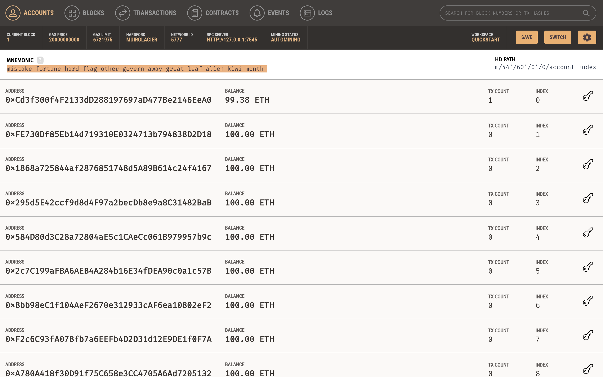
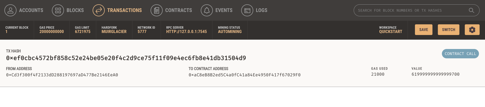

# KryptoJobs2Go
Fintech bootcamp Unit 19 homework - Executing Etherium transactions using Ganache

## Execution instructions:
1. Create .env file in the execution folder with MNEMONIC phrase - This will be used to generate the eth account
2. Run Ganache while running the app - if you use a different blockchain, you will need to change the Web3 HTTP provider (in the krypto_jobs.py file)
3. In the terminal, run the Streamlit application by typying
 ```streamlit run krypto_jobs.py``` 

## Screenshots of Ganache after executing a transaction:

### Accounts screen


## Transactions screen

